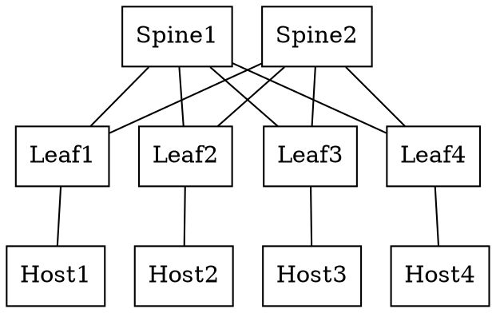

# Simple Spine Leaf Topology with cEOS devices

## Description

A simple 3-Stage folded Clos with `n=2, m=2, r=2`

All devices are running cEOS

## Diagrams

- [Lucid Chart Diagram](https://lucid.app/lucidchart/1de2a0f8-320f-4f69-bb09-9a213a4995e5/edit?invitationId=inv_465ef07e-1b24-41a4-befe-8a53ac5e2a7c)

### Graphviz

