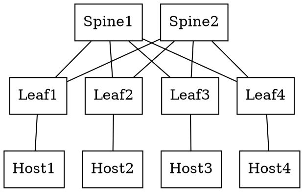

# Simple Spine Leaf Topology with cEOS devices

## Description

A simple 3-Stage folded Clos with `n=2, m=2, r=2`

All devices are running cEOS

## Diagrams

- [Lucid Chart Diagram](https://lucid.app/lucidchart/1de2a0f8-320f-4f69-bb09-9a213a4995e5/edit?invitationId=inv_465ef07e-1b24-41a4-befe-8a53ac5e2a7c)

### Graphviz

## Addressing 

- All hosts addresses are of the form `10.100.10${hostID}.10` as an example host1 has the ip address `10.100.101.10`
- All leaf loopbacks are of the form `192.168.101.${leafID}` as an example lo0 of leaf1 has the ip address `192.168.100.1`
- All spine loopbacks are of the form `192.168.100.${spineID}` as an example lo0 of spine1 has the ip address `192.168.101.1`
- The mgmt interfaces for the spines are of the form `172.20.20.10${spineID}` as an example mgmt interface of spine1 has the ip address `172.20.20.101`
- The mgmt interfaces for the leafs are of the form `172.20.20.1${spineID}` as an example mgmt interface of leaf1 has the ip address `172.20.20.11`
- The mgmt interfaces for the hosts are of the form `172.20.20.20${hostID}` as an example mgmt interface of host1 has the ip address `172.20.20.21`

- All spine <-> leaf ptps are addressed from within `10.10.10.0/24`
    - spine1 `10.10.10.0/31` <-> leaf1 `10.10.10.1/31`
    - spine1 `10.10.10.2/31` <-> leaf2 `10.10.10.3/31`
    - spine1 `10.10.10.4/31` <-> leaf3 `10.10.10.5/31`
    - spine1 `10.10.10.6/31` <-> leaf4 `10.10.10.7/31`
    - spine2 `10.10.10.8/31` <-> leaf1 `10.10.10.9/31`
    - spine2 `10.10.10.10/31` <-> leaf2 `10.10.10.11/31`
    - spine2 `10.10.10.12/31` <-> leaf3 `10.10.10.13/31`
    - spine2 `10.10.10.14/31` <-> leaf4 `10.10.10.15/31`
